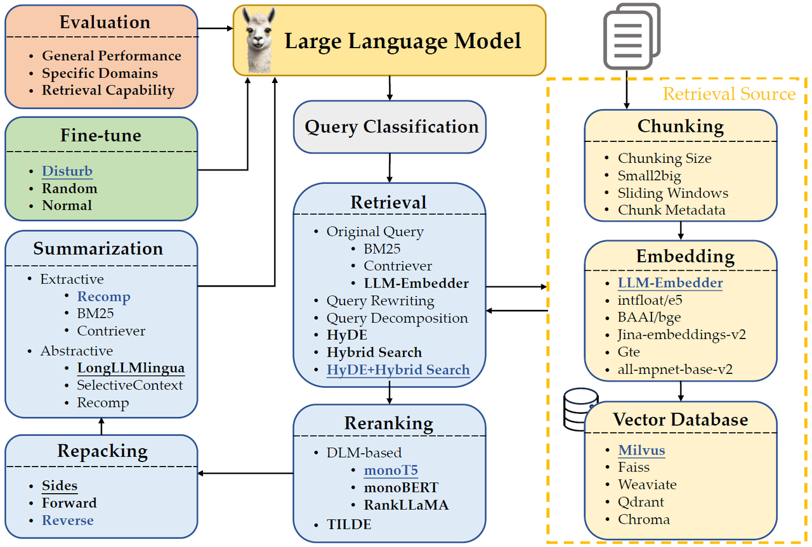

# RAG最佳实践

#### 介绍
大模型检索增强生成技术最佳实践。本项目对论文[Searching for Best Practices in Retrieval-Augmented
Generation](https://arxiv.org/abs/2407.01219)中提到的方案进行实现，论文中将RAG过程划分为如下阶段，并通过实验说明每个阶段模块选择最佳实践方案。

- Query Classification：并非所有查询都需要检索增强。
- Chunking：块大小显著影响性能。更大的块提供了更多的上下文，增强了理解，但增加了处理时间。较小的分块提高了检索的召回率，减少了时间，但可能缺乏足够的上下文。使用sliding window技术更加有效，即将文本按照句子进行划分，每个块包含窗口大小个句子。
- Embedding：嵌入模型选择LLM-Embedder，其与BAAI/big-large-en的效果相当，但前者的大小比后者小三倍。
- Vector Database：Milvus支持多种索引类型、十亿规模的向量支持、混合搜索和云原生能力。
- Retrieval：HyDE（pseudoDoc+query）+Hybrid Search（=0.3*BM25+Original embedding）。
- Reranking：monoT5模型参数量小且准确率相对较高，RankLLaMA绝对准确率更高。
- Repacking：reverse方式最好。
- Summarization：Recomp | Fangyuan Xu,Weijia Shi, and Eunsol Choi. Recomp: Improving retrieval-augmented lms with compression and selective augmentation. arXiv preprint arXiv:2310.04408, 2023.
- Generator Fine-tuning：混合相关和随机上下文可以增强生成器对无关信息的鲁棒性，同时保证相关信息的有效利用。用一个相关文档和一个随机选择的文档来训练。

我将对上述模块进行逐一实现，develop分支将持续更新，master分支版本使用较为稳定。

#### 软件架构
项目基于 LlamaIndex RAG框架实现，向量数据库选择Qdrant。
大模型选择基于Ollama本地调用qwen2-1.5b模型，嵌入模型选择BAAI/bge-large-zh-v1.5。
选择原因：
1. LlamaIndex框架对当前较为常用的技术进行了模块化封装，个人认为相较于langchain框架来说，其抽象层级更高，把更多的时间用于高层次的思考，而不是陷入编程的细节。
2. Qdrant数据库比Milvus更容易部署，且文档较为详细直观。


#### 安装教程

1. 通过镜像安装依赖库；
    `pip install -i https://pypi.doubanio.com/simple/ -r requirements.txt`
2. 基于Ollama下载qwen2-1.5b到本地（设备允许的话建议选择参数量更大的模型，直接调用商业api也可以，代码中也给出了使用glm4模型的示例）； 
3. 首次运行时修改main.py中HuggingFaceEmbedding函数参数：local_files_only=False
4. 运行main.py。

#### 参与贡献

1.  Fork 本仓库
2.  新建 Feat_xxx 分支
3.  提交代码
4.  新建 Pull Request

#### 引用
项目基于如下论文：
```
@inproceedings{Wang2024SearchingFB,
title={Searching for Best Practices in Retrieval-Augmented Generation},
author={Xiaohua Wang and Zhenghua Wang and Xuan Gao and Feiran Zhang and Yixin Wu and Zhibo Xu and Tianyuan Shi and Zhengyuan Wang and Shizheng Li and Qi Qian and Ruicheng Yin and Changze Lv and Xiaoqing Zheng and Xuanjing Huang},
year={2024},
url={https://api.semanticscholar.org/CorpusID:270870251}
}
```